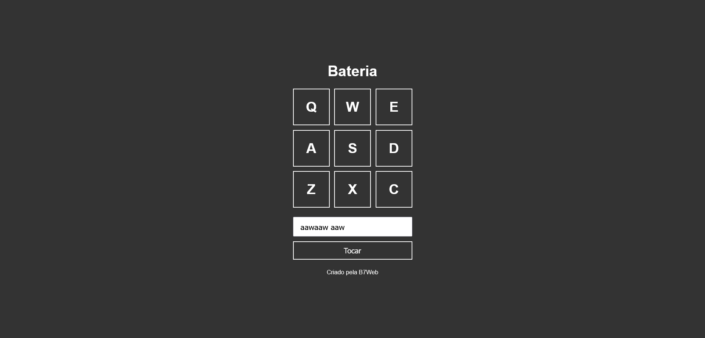

# Simple drumkit using JavaScript, created by B7Web

## Overview

### Screenshot

### Links

-   Solution URL: Working on it.

## My process

### Built with

-   Semantic HTML5 markup
-   CSS custom properties
-   JavaScript

### What I learned

In this project i could learn how to use event listeners to play audios in order to play simple drum rythms on the keyboard.

## Author

-   GitHub - Vinícius dos Santos Verissimo (https://github.com/viniciusdsv93)
